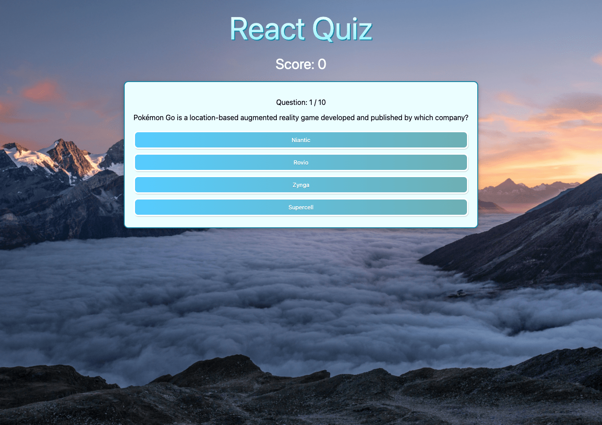

# React TypeScript Quiz

This application presents the player with 10 randomized questions from the Open Trivia Database and indicates when a question is answered correctly or incorrectly.

The application was built following the freeCodeCamp tutorial on YouTube [here](https://www.youtube.com/watch?v=F2JCjVSZlG0).

## Tools Used

The following tools were used in the development of this application:

- `React` for component building and state management
- `TypeScript` for static typing and application development
- `styled-components` for application styling

## Screenshot

This is a screenshot of the deployed application!

## References

- https://reactjs.org/
- https://www.typescriptlang.org/
- https://styled-components.com/
- https://opentdb.com/
